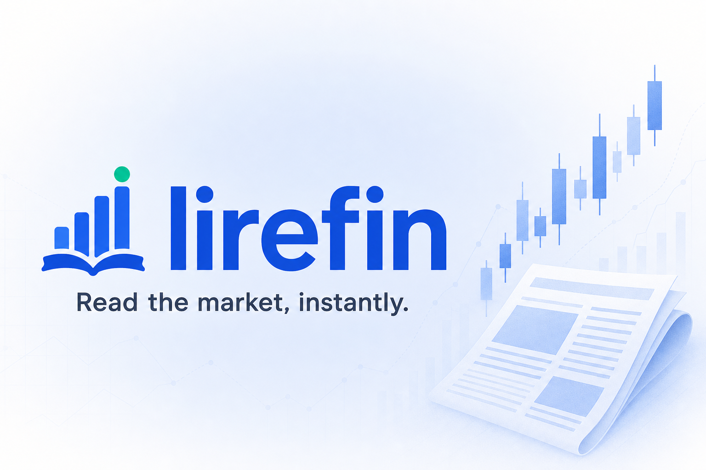

# Lirefin

> Read the market, instantly.



**Lirefin** ("lire" *to read* + "fin" *finance*) — Chrome extension'ı + Node.js/Fastify backend proxy'si. Açtığınız finansal haber sayfalarını otomatik tespit eder, **portföyünüzdeki varlıklar için Claude AI ile bullish / nötr / bearish analizi** üretir. Çok dilli haber algılama (Claude tarafında otomatik) ve **kullanıcı seçtiği dilde** yorum.

```
[ Web sayfası ] -> [ Content Script ] -> [ Service Worker ] -> [ Backend ] -> [ Claude ]
                                                                     |
                                                                  Finnhub (ticker arama)
```

## Özellikler

- 25+ finansal haber sitesini otomatik tespit eder (URL whitelist + DOM heuristics)
- [Mozilla Readability](https://github.com/mozilla/readability) ile temiz makale metni çıkarımı
- Claude'un `tool_use` API'si ile **garanti yapılandırılmış JSON** çıktısı
- Portföy yönetimi: ABD hisse + ETF, Avrupa (XETRA, LSE, Euronext) ve Asya (TSE, HKEX, KOSPI) borsaları — Finnhub destekli debounced ticker arama
- 13 dilde çıktı: TR, EN, DE, FR, ES, IT, PT, NL, JA, ZH, KO, AR, RU
- Chrome Side Panel ana UI + sayfa içinde küçük floating action button + popup
- Backend proxy: API anahtarı sadece sunucuda; cihaz başına rate limit + 5 dk cache

## Klasör Yapısı

```
packages/
  shared/      # zod şemaları + paylaşılan tipler (@fni/shared)
  extension/   # Chrome MV3 extension (Vite + CRXJS + React) (@fni/extension)
  backend/     # Fastify proxy (Anthropic + Finnhub) (@fni/backend)
```

## Kurulum

### Önkoşullar

- Node.js 20+ ve pnpm 9+ (`corepack enable`)
- [Anthropic API anahtarı](https://console.anthropic.com/)
- [Finnhub API anahtarı](https://finnhub.io/) (ücretsiz tier yeterli)

### Bağımlılıklar

```bash
pnpm install
```

### 1) Backend

```bash
cp .env.example packages/backend/.env
# packages/backend/.env içine ANTHROPIC_API_KEY ve FINNHUB_API_KEY girin

pnpm dev:backend
# http://localhost:8787
```

Health check:

```bash
curl http://localhost:8787/health
```

### 2) Extension (development)

```bash
pnpm dev:extension
# Vite dev server: 5173
# Build çıktısı: packages/extension/dist
```

Sonra Chrome'da:

1. `chrome://extensions` adresine gidin
2. **Developer mode**'u açın (sağ üst)
3. **Load unpacked** → `packages/extension/dist` klasörünü seçin
4. Eklenti ikonuna sağ tık → **Pin** ile sabitleyin
5. İkona tıklayın → **Settings** ile portföy + çıkış dilini yapılandırın
6. Bir finansal haber sitesini açın (örn. [Reuters Markets](https://www.reuters.com/markets/), [CNBC](https://www.cnbc.com/markets/)) — extension ikonu üzerinde mavi nokta belirir ve sayfa altında "Analyze" butonu görünür

## Production Build

```bash
pnpm build
# packages/extension/dist  -> Chrome Web Store yüklenebilir (zip)
# packages/backend/dist    -> Node.js çıktısı
```

Backend'i deploy etmek için:

- **Railway / Fly.io / Render**: `packages/backend/Dockerfile` kullanın
- **Cloudflare Workers**: `fastify` -> `hono` migrasyonu gerekir (gelecek sürüm)

Production'a aldıktan sonra extension'ın Options sayfasındaki **Backend URL** alanını güncelleyin (örn. `https://api.your-domain.com`).

## Mimari

### İstek Akışı

1. Content script sayfa yüklendiğinde **whitelist + heuristic** kontrolü yapar.
2. Finansal haber tespit edilirse service worker'a haber verir → ikon badge'i + FAB.
3. Kullanıcı analiz başlatır → service worker side panel'i açar, content script'ten **Readability** ile makale metnini çeker.
4. Backend'e `POST /api/analyze` gönderilir (URL, başlık, makale metni, portföy, çıkış dili, device ID).
5. Backend `tool_use` ile Claude'a istek atar. Claude `submit_portfolio_analysis` aracını çağırır → garanti şemalı JSON.
6. Yanıt zod ile doğrulanır, 5 dk cache'lenir, side panel'e ulaştırılır.
7. UI her varlık için **bullish / neutral / bearish** + güven yüzdesi + gerekçe + ilgili alıntı gösterir.

### Veri Şemaları

`packages/shared/src/schemas.ts` — hem extension hem backend tarafından kullanılan zod şemaları:

- `AnalyzeRequest`, `AnalyzeResponse`, `AssetAnalysis`
- `TickerSearchQuery`, `TickerSearchResponse`
- `Sentiment` = `"bullish" | "neutral" | "bearish"`

## Gizlilik

- API anahtarları **sadece backend'de** tutulur.
- Backend makale metnini **kalıcı olarak loglamaz** veya saklamaz.
- Cache anahtarı SHA-256 hash'tir; TTL 5 dakika.
- CORS sadece `chrome-extension://<EXT_ID>` ve yapılandırılmış (ALLOWED_ORIGINS) kaynaklara açıktır.
- Cihaz tanımlama: `crypto.randomUUID()` ile üretilen rastgele bir UUID, `chrome.storage.sync` üzerinden senkronize edilir; rate limit anahtarı olarak kullanılır.

## Disclaimer

Bu eklenti tarafından üretilen yorumlar **yatırım tavsiyesi değildir**. Yapay zekâ üretimi içerik hatalı veya yanıltıcı olabilir. Tüm yatırım kararları kullanıcıya aittir.

## Katkı

PR ve issue'lar memnuniyetle karşılanır. Geliştirme yaparken:

```bash
pnpm typecheck   # tüm paketler
pnpm build       # tüm paketler
```

## Lisans

MIT
